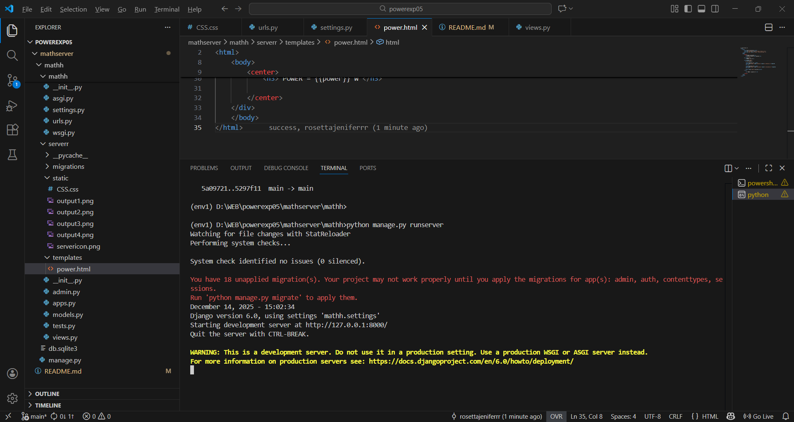
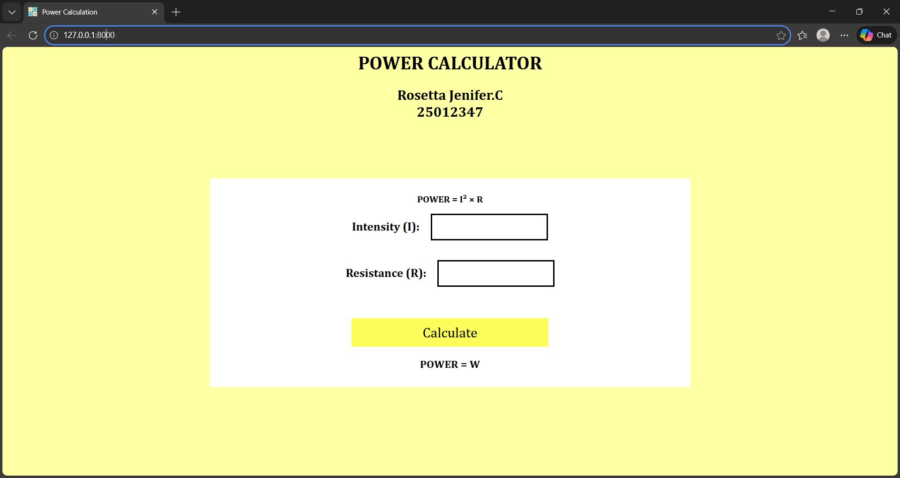
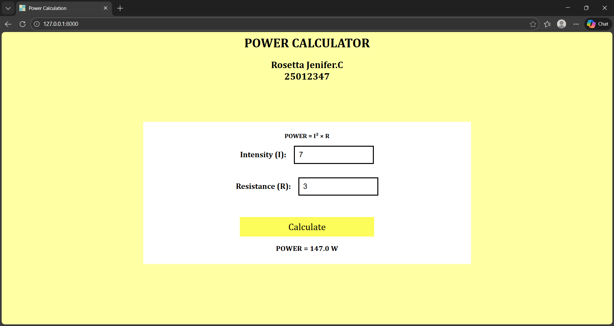

# Ex.05 Design a Website for Server Side Processing
# Date:
# AIM:
To design a website to calculate the power of a lamp filament in an incandescent bulb in the server side.

# FORMULA:
P = I2R
P --> Power (in watts)
 I --> Intensity
 R --> Resistance

# DESIGN STEPS:
## Step 1:
Clone the repository from GitHub.

## Step 2:
Create Django Admin project.

## Step 3:
Create a New App under the Django Admin project.

## Step 4:
Create python programs for views and urls to perform server side processing.

## Step 5:
Create a HTML file to implement form based input and output.

## Step 6:
Publish the website in the given URL.

# PROGRAM :

power.html

```html


<html>
    <head>
        <title>Power Calculation</title>
        <link rel="stylesheet" href="">
        <link rel="icon" href="">
    </head>
    <body>
        <center>
            <h1>POWER CALCULATOR</h1>
            <h2>Rosetta Jenifer.C<br>25012347</h2>

        <div class="box">
            <p>POWER = I² × R</p>
            
        <form method="POST">
            

            <label>Intensity (I): </label>
            <input type="number" name="intensity" value="{{ intensity }}" required>
            <br> <br>

            <label>Resistance (R):</label>
            <input type="number" name="resistance" value="{{ resistance }}" required>
            <br> <br>
            
            <button type="submit">Calculate</button>
        </form>
            
            <h3> POWER = {{power}} W </h3>

        </center>
    </div>
    </body>
</html>

CSS.css 
```CSS

body {
    background-color: rgb(255, 255, 164);
    font-family: Cambria;
}
.box {
    width: 800px;
    background: white;
    padding: 10px;
    margin: 100px auto;
    border: 3px black;
    border-radius: 3px;
    text-align: center;
    height: auto;
}
input {
    width: 200px;       
    padding: 10px;     
    font-size: 18px;  
    margin-bottom: 15px;
    border: 3px solid black;
}

label{
    font-size: 20px;   
    font-weight: bold; 
    width: 150px;     
    text-align: right;  
    margin-right: 15px;
}
p{
    font-size: medium;
    font-weight: bold;
}
button {
    background-color: rgb(252, 252, 90);
    font-family: Cambria;
    margin-top: 20px;
    padding: 10px;
    width: 42%;
    color: rgb(0, 0, 0);
    border: 2px;
    font-size: 24px;
    cursor: pointer;
}

views.py 
```views

from django.shortcuts import render

def home(request):
    power = ""
    intensity = ""
    resistance = ""

    if request.method == "POST":
        intensity = request.POST.get("intensity", "")
        resistance = request.POST.get("resistance", "")

        if intensity and resistance:
            I = float(intensity)
            R = float(resistance)
            power = (I ** 2) * R
        
        else:
             intensity = ""
             resistance = ""

    return render(request, "power.html", {
        "intensity": intensity,
        "resistance": resistance,
        "power": power
    })


urls.py 
```urls

from django.contrib import admin
from django.urls import path
from serverr import views

urlpatterns = [
    path('admin/', admin.site.urls),
    path('', views.home , name="home"),
]

```

# SERVER SIDE PROCESSING:


# HOMEPAGE:





# RESULT:
The program for performing server side processing is completed successfully.
